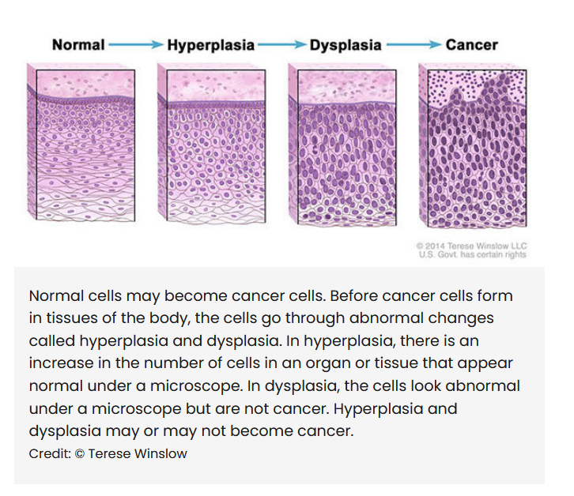

# Definition of cancer

Cancer is a genetic disease in which some of the body's cells start to behave abnormally, grow without control and spread to other regions of the body. It has the ability to infiltrate and destroy the normal body tissue and to spread throughout the entire body.

It's caused by changes to the genes that control the way our cells function and damage to the DNA caused by harmful substances in the environment such as the chemicals in tobacco smoke and U.V rays from the sun.
# Overview

Cancer cells do not heed the normal signals that regulate the CCCS, they do not stop dividing even when growth factors are against it. The main cause is unknown but they all boil down to the same base which is abnormality; which is almost always a change in one or more genes. Cancer generally occurs as a mistake. A simple gene mistake that nobody knew could have been this destructive, it could be a result of a cell going rogue (aggressive) or a cell dying, being unable to kill itself and the immune system being unable to kill it too. In both of those cases, it evolves into a worse case which is cancer.

All of that causes abnormal or damaged cells to grow and multiply when they shouldn't, these cells may form a ***tumor***, i.e: a lump of tissue (a big piece). If it's not cancerous as in not resource-intensive its name is a ***benign tumor***. When it's a cancerous its name is a ***malignant tumor.***

These tumors can spread into nearby tissue and further places in the body to form new tumors (a process called metastasis). Many cancers form solid tumors, but cancers of the blood such as leukemias, do not.

Cancer cells generally probably occur due to a problem in the CCCS as previously stated, where it can just stop and continue the cell cycle whenever it'd like to rather than normal checkpoints, moreover, cancer cells can go and divide infinitely as long as the nutrients required for sustenance are available. In general, they're immortal, proof for this is cancer cells from a cancer patient continuing replication to this day.

These cells can be transformed cells from healthy cells, however, these cells don't undergo the repair mechanism used for stuff like the cell cycle ("apoptosis").

A cell that's gone bad in anyway is usually classified as a nonself by tagging itself by a protein so that the immune system gets rid of it to not cause further harm.

Cancer cells tend to cause changes to neighboring cells by releasing proteins for example that signal the body to grow body vessels towards it, or perform ***metastasis*** which is the spreading of the tumor through the blood vessels and lymph vessels.

# General comparison between cancer cells and normal cells

To summarize, cancer cells acquire the following properties:

1. Grow in the absence of growth factors.
2. Ignore signals that normally tell cells to stop dividing or to die (apoptosis).
3.  Invade into nearby areas and spread into other areas of the body which causes normal cells to stop growing when they encounter other cells.
4. Releases orders for blood vessels to grow towards the tumors to supply oxygen and get rid of wastes.
5. Hide from the immune system.
6. Trick the immune system into helping cancer stay alive and grow. 
7. Cause abnormalities in the chromosomes, such as duplications and deletions of chromosomal parts, some cancer cells have 4N number of chromosomes.
8. Rely on different kinds of nutrients than normal cells, they also perform metabolism in a way that makes them grow quicker. 
These factors are the main factors scientists have studied to try and cut off all living supplements for the cancer cells, therefore trying to kill them out.

The body usually eliminates cells with damaged DNA before they turn cancerous, but the body's ability to do so goes down by age.

# Genes that cause cancer

The genetic changes that contribute to the formation of cancer tend to affect three main types of genes, proto-oncogenes, tumor suppressor genes and DNA repair genes. These are called "drivers" of cancer.

Proto-oncogenes are involved in normal cell growth and division, however if altered or tampered with, they turn abnormal and turn more active than normal, they become cancer causing genes (oncogenes).

Tumor suppressor genes are supposed to stop tumors from forming by limiting the duplication of a cell, without this it may divide in an uncontrollable manner.

DNA repair genes are involved in repairing incorrect DNA post-replication, if this isn't present an error in the genes is gonna occur, cause mutations and cancer.

Metastatic cancer is the name of the cancer that has spread to another region of the body, it has the same name as the parent cancer, i.e: metastatic lung cancer while it's in the liver.

# Tissue changes that are not cancer

Some tissue in the body changes which isn't cancer, they might develop into cancer if they aren't treated. The following is 3 types of tissue changes that must be monitored because they could become cancer.

## Hyperplasia occurs
when a tissue multiplies faster than predicted, but the tissue still looks organized, this can happen due to chronic irritation.

## Dysplasia occurs
when there's faster division and a less organized manner than hyperplasia, cells look more abnormal and this could be a sign of growing cancer, although this could be something like a mole (black spots on your skin).

Carcinoma in situ is just what people call cancer stage 0, although it's not cancer, it just feels like it because the cells are abnormal. It just doesn't invade the nearby tissue.

Classification of types of cancers is most likely according to the name of the cell it originated from, there are over 100 types of cancer.

# Risk factors

Cancer isn't directly caused by these, but if they're found, they contribute to higher chances of it happening.

1. Family history, if the family has a history of dying to cancer.
2. Smoking
3. Environmental factors like lead, arsenic and whatnot
4. Malnutrition as high fat or high sugar foods can increase the risk for many types of cancer.
5. Hormone replacement therapy can cause breast cancer and uterine cancer for females assigned at birth.
6. Radiation exposure over the sunlight.
7. Age

# Symptoms

Cancer's symptoms depend on what type of cancer you have, but these are the most common ones

1. Fatigue
2. Fever
3. Loss of appetite
4. Night sweats
5. Persistent pain especially in the region of the tumor
6. Weight loss
7. In some places it could cause blood in pee or stool, coughing up blood and lumps.
These are no measurement for yourself to say you have cancer, as cancer is easily diagnosed and can be extremely severe depending on which stage it was diagnosed in.

# Diagnosis

To diagnose cancer early, you should do regular check-ups monthly for you and your family and also run blood tests for cancer, imaging tests, biopsies incase of something severe and genetic testing for cancer.

The cancer stage is determined depending on the tumor's size and location.

From stage one to three, the cancer has grown directly into the surrounding tissue or has spread to nearby lymph nodes, not far off.

stage four is when the cancer cells have gone to different parts of the body distant from the source throughout the lymphatic system or bloodstream.

# Treatment

1. Surgery to prevent the spreading of the tumor
2. Chemotherapy to kill off the cancer (but it also kills off healthy cells which causes hair loss and fatigue).
3. Radiation therapy, which kills the cancer with high doses of radiation.
4. Immunotherapy which engages your immune system to fight (this is new I believe).
5. Targeted therapy which targets the genetic mutations that turn healthy cells into cancerous.
6. Hormone therapy which blocks cancer causing hormones.
7. Bone marrow transplant in case of leukemia to replace damaged blood stem cells with healthy ones.

# Prevention

1. Stop smoking if you smoke, quit, this can cause other types of cancer other than lung cancer, it also harms other people.
2. Avoid excessive sun exposure.
3. Eat a healthy diet.
4. Exercise most days of the week.
5. Maintain a healthy weight.
6. Schedule cancer screening exams to check up on yourself regularly.
For men, they should be checking regularly for testicular cancer and for women it should be breast and ovarian cancer.

A fun evil fact about cancer is that there's a rare type of tumor that may contain immature or fully formed tissue, including ***teeth, hair, bone and muscle***. Their name are teratomas.