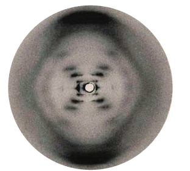
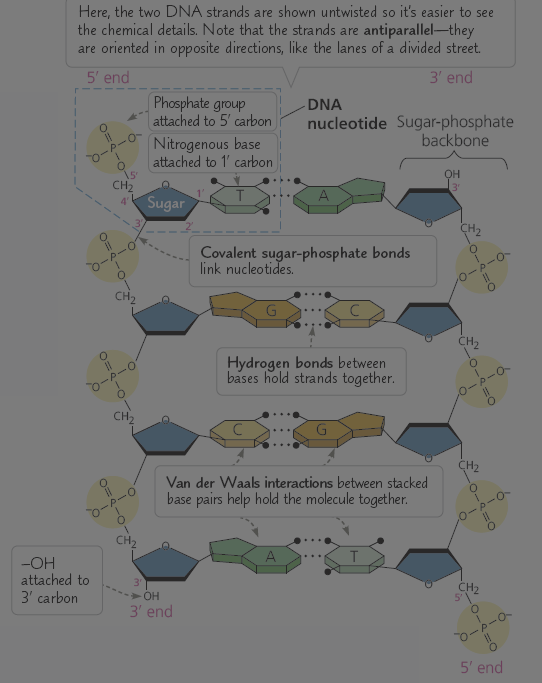
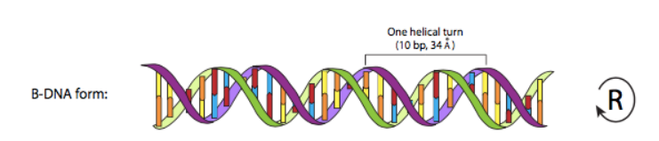
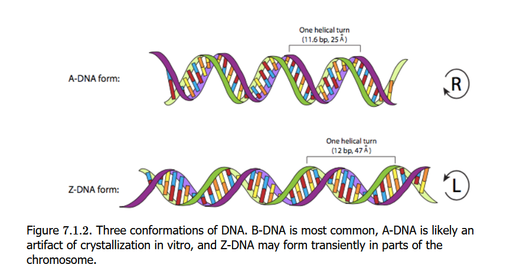
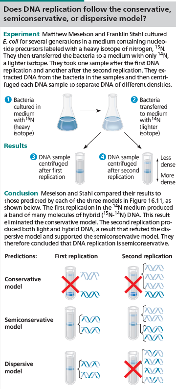
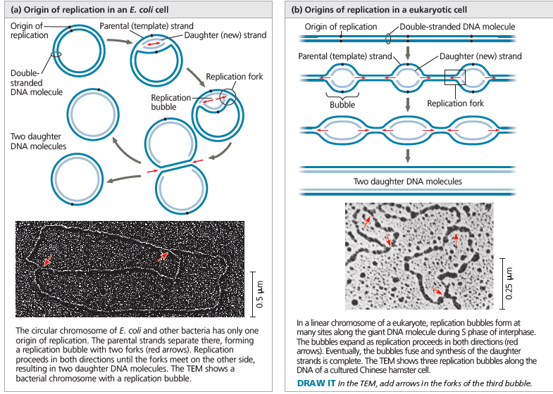
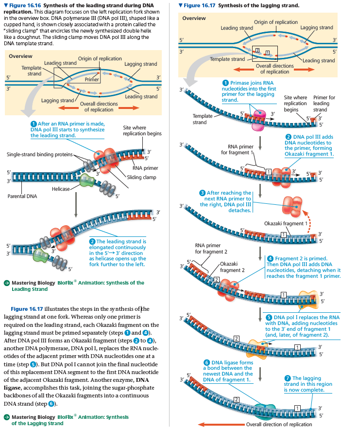
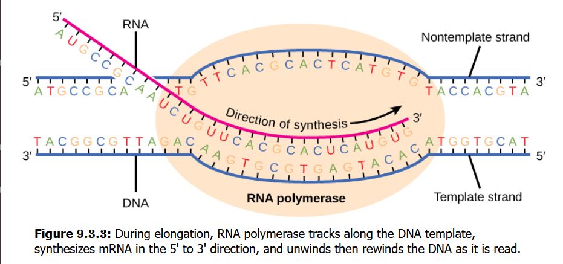
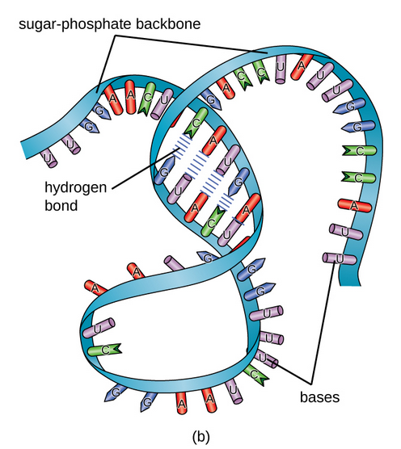

DNA which is an essential component of the nucleus (or cell membrane in the case of prokaryotes-). It contains all the data required for any cell of an organism to function, it also includes replication data, some of this data can be malformed but possibly fixed if damage done isn't too major. Most likely no errors occur in prokaryotes as they usually directly copy the data and split into two. 

Although, in some way it may transform bacteria, for example, Frederick Griffith was trying to develop a vaccine against Pneumonia, he was studying Streptococcus Pneumoniae; there are two types of it, pathogenic and non-pathogenic, he had killed the pathogenic bacteria with heat and mixed them with the non-pathogenic bacteria. 

It was observed that the non-pathogens became pathogens and inherited the traits of the killed bacteria, what's even more surprising it that the daughter cells of the non-pathogenic pathogenic bacteria were pathogenic. That is called a change in genotype and phenotype due to assimilation of external DNA by a cell.

DNA (Deoxyribonucleic acid) is a polymer which is the second main chemical composer of chromosomes (wrapped around histone proteins),, contain nucleotides which are their main building units. The main building unit of nucleotides themselves are nitrogenous bases, a pentose sugar called deoxyribose and a phosphate group. 

The bases can be Adenine (A), Guanine (G), Cytosine (C) and Thymine (T). Note the similarity between Adenine, Guanine and Cytosine, Thymine.. which lead to the classification of A and G as purines, C and T as pyrimidines. 

The naming convention of DNA is significant where deoxyribose means that its a ribose molecule with one less oxygen. In the more specific composition, there is a hydroxyl group (-OH) attached to the 2-carbon of ribose, there is only a hydrogen (H-) attached to the 2-carbon of deoxyribose and a phosphate group is attached to both.

The hydroxyl and phosphate groups are what identify the directionality of the DNA, where the -OH indicates 3' and a free phosphate indicates 5' (directionality is either 3' to 5' or 5' to 3', if a strand is 3' to 5' then the opposite strand is flipped upside down and has opposite genetic code, as well as the opposite direction 5' to 3'). 

The phosphate is the main backbone of the DNA structure, it shapes the DNA and is the main connection between every pentose sugar (deoxyribose).

DNA has two primary strands wrapped together in a double-helix shape ***(USUALLY)***, this was proved by the diffraction of X-rays off of DNA fibers of purified DNA.  Watson (colleague of Crick who contributed to a model for the DNA) was familiar with this type of X-ray diffraction pattern which allowed them to conclude that DNA is in a helical shape (helix) and was made up of two strands rather to a three-stranded model proposed by Linus Pauling.

The two strands' sugar-phosphate backbones are antiparallel (they run in opposite directions.).

In DNA, the nitrogenous bases form hydrogen bonds with the opposite nitrogenous bases, the number of hydrogen bonds indicates the type of bases connecting. 
The nitrogenous bases are also hidden in the interior of the DNA due to their hydrophobic nature, while the phosphate groups faced the aqueous surrounding, therefore fortifying the nitrogenous bases. 
The nitrogenous bases are attached to the 1' carbon of the deoxyribose sugar. The pentose sugars form covalent sugar-phosphate bonds to link nucleotides and Van der Waals between stacked pairs to help the molecule stay bound together.

If two hydrogen bonds are present, then Adenine and Thymine are bound together. If three bonds are present then Guanine and Cytosine are bound together.

RNA is mostly single-stranded because under the right conditions, DNA could be made single-stranded and RNA can be double-stranded. The molecules are so similar that it's even possible to create double-stranded hybrid molecules with one strand of DNA and one of RNA. In another observation, RNA-RNA double helices and RNA-DNA double helices are actually slightly more stable than the traditional DNA-DNA double helix. 

RNA is slightly different in DNA where the Thymine is Uracil (U) instead.

Because there's a one-to-one pairing of nucleotides, it turns out that the two strands are essentially backup copies of eachother, a safety net if nucleotides are lost from one strand, even if the two strands are damaged if the area backing up the data in the opposite strand isn't damaged then it's fine. Keep in mind that even though they can backup each others information, they're not identical. They're complementary.

The left strand of DNA is mostly 5' to 3' from top to bottom and the other is 3' to 5' from top to bottom. (or 5' to 3' from bottom to top.).

DNA is negatively charged if looked at from a physical point (due to the phosphates), B-DNA which is the most common way to look at it in a right-handed twist, one full twist of the molecule has 10 base pairs with 0.34nm between each nucleotide base. Each of them is planar and paired with the complementary base, it forms a planar "rung" on the "ladder" of DNA. These are perpendicular to the longitudinal axis of the DNA, best described in the following image:
Most DNA in a cell or any aqueous solution is found in this B formation. But there are other forms under specific environmental circumstances.

# DNA replication

The double helical shape for the DNA allowed for hypotheses of how the DNA replication is performed, scientists thought of three models of replication it could follow which are the conservative model (the parent shape is identical in the daughter DNA formations), semi-conservative model (The DNA is split into two strands and their complementary strands are formed) and the dispersive model (A mix of old and newly synthesized DNA).
They could rule out the correct method it duplicates through an experiment using E. coli (Bacteria). They had the bacteria cultured in a medium with a $^{15}N$ heavy isotope then transferred to a medium with a $^{14}N$ lighter isotope then they took one sample after the first DNA replication and another after the second replication. They extracted DNA from the bacteria in those samples and then centrifuged each DNA sample to separate the DNA of different densities. The results supported the semiconservative model of replication.

The replication of chromosomal DNA begins at sites called origins of replication, they're short stretches of DNA that have a specific sequence of nucleotides.
The E. coli chromosome, is circular and has a single origin, much like normal bacteria and it wraps around itself. The protein DnaA is the initiator and the one that initiates DNA replication. The proteins that initiate DNA replication recognize that this sequence and attach to the DNA, separating the two strands and forming a replication fork, making a replication bubble.
In eukaryotes, chromosomes may have hundreds or even a few thousand replication origins. 

The replication fork is the point where the parental strands of DNA are being unwound by Helicase, separating them and making them template strands. After they separate, single-strand binding proteins bind to the unpaired DNA strands, keeping them from re-pairing. Topoisomerase is an enzyme present to help relieve the strain caused by the untwisting by breaking, swiveling and rejoining the DNA strands. Primase is an enzyme present to generate primers which are a short stretch of RNA (usually 5 to 10 nucleotides long) into the DNA strand template which forms the complementary RNA strand to indicate the starting point of the DNA. 

The complementary RNA strand is the starting point that indicates where to start synthesizing the new DNA complementary strands, the strands start from the 3' end of the RNA primer and are composed by enzymes called DNA polymerases. It performs this synthesis until it reaches the end of the strand, it has a rate of 500 nucleotides per second in bacteria and 50 per second in human cells. 

Each nucleotide to be added to a growing DNA strand consists of sugars attached to a base and to three phosphate groups, this is the ATP molecule, the only difference between the ATP of energy metabolism and dATP is that the adenine nucleotide used to make DNA is the sugar component, which is deoxyribose in the building block of DNA but ribose in ATP (like the comparison between DNA and RNA).

Like ATP, the nucleotides used for DNA synthesis are chemically reactive, partly because their triphosphate tails have an unstable cluster of negative charges, as mentioned before.

The way polymerase synthesizes each monomer is by a condensation reaction.

Due to the anti-parallel nature of DNA, the polymerase can only attach to the 3' end of the primer and not the 5' end to generate a 5' prime to 3' prime direction to be antiparallel to the 3' to 5' template strand.

To elongate the other new strand of DNA in the required 5' to 3' direction, the polymerase must work along the other template strand in the direction *away* from the replication fork. This is done on a strand whose name is the lagging strand. In contrary to the strand being made with the leading strand continuously, this one is made in a discontinuous way as a series of segments. These segments are often called Okazaki fragments. This is due to the existence of multiple primers for separate fragments, an enzyme called Ligase then forms a bond between the fragments.

Post-replication, the polymerase performs proofreading of each nucleotide against its template as soon as its covalently bonded to the growing strand. 
When it finds an incorrectly paired nucleotide, it removes the nucleotide and continues synthesis, this makes 1 nucleotide have an error in 10 billion nucleotides.
Each cell continuously monitors and repairs its genetic material. The structural integrity and the remain of the state of the DNA is something that causes the increase of the number of DNA repair enzymes and their essentiality.

In some cases when a segment of a strand is at fault, a DNA-cutting-enzyme (nuclease) would cut it out and the voided gap is filled with nucleotides using the undamaged strand as a template, the enzymes that fill the gap are DNA polymerase and DNA ligase.

# DNA Transcription (Reading of DNA into mRNA)

In both prokaryotes and eukaryotes, the second function of DNA (the first function was replication) is replication. This provides the necessary information crucial for the production of mRNA because the DNA contains the data required to produce amino acids by generating mRNA, sending it out the nuclear pores and accompanying polypeptides in ribosomes, they're able to produce amino acids necessary for protein production.

The copying of DNA to mRNA is relatively straightforward, with one nucleotide being added to the mRNA strand for every complementary nucleotide read in the DNA strand. The process of translation to protein is more complex because groups of three mRNA nucleotides correspond to one amino acid of the protein sequence.

The steps of transcription are as follows: Initiation, elongation and termination.

1. Initiation
Transcription requires the DNA strands to partially unwind in the region of mRNA synthesis. The DNA sequence onto which the proteins and enzymes involved in the transcription bind to initiate the process is called a promoter, they exist to identify whether the corresponding gene is transcribed all the time, some of the time or hardly at all.

2. Elongation.
Transcription always proceeds from one of the two DNA strands. The mRNA product is complementary to the template strand, but the Thymine is replaced with Uracil, therefore making it somewhat identical to the non-template strand.
An enzyme called RNA polymerase proceeds along the DNA template adding nucleotides complementary to the DNA template similar to DNA replication, with the difference that the resultant RNA strand is not bound to the DNA template. As it's being produced the unwound part starts wounding again.

3. Termination
Once a gene is transcribed, the polymerase needs to be instructed to disconnect from the DNA template and release the newly formed mRNA. There are two kinds of termination signals but both involve the same steps. In a eukaryotic cell, once that's done, the mRNAs undergo processing before they can be transferred to the nuclear pores and translated into a protein by a ribosome. The additional steps involved create a molecule that is much more stable than prokaryotic mRNA. For example: Eukaryotic mRNAs last for several hours in contrary to prokaryotic mRNA's 5 seconds.

It's coated in RNA-stabilizing proteins to prevent it from degrading during processing. This happens during the immersion of the mRNA strand during transcription by adding a special nucleotide cap to the 5' end of the growing mRNA.

Once done, an enzyme then adds a string of approximately 200 Adenine residues to the 3' end, called the poly-A tail. This tail signals to the cell that this transcript needs to be exported to the cytoplasm and protects it from degradation.

RNA is composed of a sugar phosphate backbone and this sugar is called ribose, not deoxyribose as it contains one more oxygen atom. 
Even though RNA is a single strand, most types show extensive intramolecular base pairing between complementary sequences within the same RNA strand.
