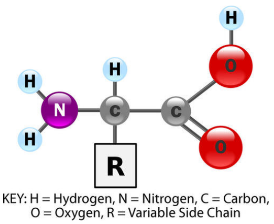
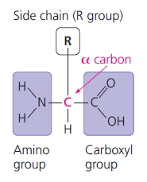

Every dynamic function or function that requires a body component to perform a dynamic task depends on proteins. For example: the flexibility of the cell membrane is based off of cholesterol and the proteins exercise the cell membrane structure based off of it. They are one of the most abundant organic molecules in living systems as they account for 50% of the dry mass of most cells cell and they're crucial for everything an organism performs and for the percentage of them in the cell membrane is 60-80%.

They play a significant role in speeding up chemical reactions in the body where the enzymes present are actually proteins, they also control cellular communication, i.e: glycoproteins in the cell membrane and ***collagen*** which is embedded to the extracellular matrix of the cell. Enzymatic proteins help regulate metabolism by acting as ***catalysts*** to speed up chemical reactions without being consumed in the reaction itself (a property of catalysts.).

Proteins are organic compounds made up of small molecules called ***monomers*** which form up and link to be called a ***polymer***. Proteins are formed from the same set of 20 different types of amino acids, linked in ***unbranched*** (one series-ed) polymers. The bond between the amino acids to hold a protein together are called ***peptide bonds***, so a polymer of amino acids is called a ***polypeptide***.  During that formation, a dehydration reaction occurs due to the bonding of the monomers which causes an hydroxyl molecule to be taken with a hydrogen atom to exert a water molecule and achieve the peptide bond which is a covalent bond. The number of water molecules is gotten by n-1 where n is the number of amino acids in the polypeptide chain. An average eukaryotic protein contains around ***500 amino acids***, but some are much smaller (the smallest are often called peptides) and some are larger. The order that the amino acids bond together with their properties determines the shape of the protein which determines the function of the protein. In a protein, it's composed of ***Hydrogen, Nitrogen, Carbon, Oxygen and a variable side chain which is what determines the core functionality of the protein***.

Monomer: A molecule that can be bonded to other identical molecules to form a polymer. 
Polymer: A series of identical monomers attached to form one polymer.

Types and functions of proteins as previously mentioned obviously differ, from the types of proteins is structural, regulatory, contractile or protective; they may serve in transport, storage or membranes; or they may be defensive toxins or enzymes to catalyze reactions. Enzymes which are produced by cells to catalyze biochemical reactions like digestion are usually complex proteins, each enzyme is specific for the substrate (a reactant that binds to the enzyme) it acts on. Enzymes that break down their substrate area called catabolic enzymes, enzymes that affect the speed only are called catalytic enzymes.
The protein receptors you see that other proteins attach to are in on themselves, protein with a structure that indicates a protein will attach to it with the indent shape.

The primary types mentioned before and their functions are listed in the following table:

| Type              | Examples                                     | Functions                                                                                      |
| ----------------- | -------------------------------------------- | ---------------------------------------------------------------------------------------------- |
| Digestive Enzymes | Amylase, Lipase, Pepsin, Trypsin             | Help in digestion or breaking down of food into simpler glucose parts, monomers and nutrients. |
| Transport         | Hemoglobin, Albumin                          | Carries substances in the blood or lymph throughout the body.                                  |
| Structural        | Actin, Tubulin, Keratin                      | Construct different types of structures like the cytoskeleton.                                 |
| Hormones          | Insulin, Thyroxine                           | Coordinates the activity of different body systems.                                            |
| Defense           | Immunoglobulins                              | Protect the body from foreign pathogens                                                        |
| Contractile       | Actin, Myosin                                | Effect muscle contraction                                                                      |
| Storage           | Legume storage proteins, egg white (albumin) | Provide nourishment in early development of the embryo and the seedling of a plant.            |
Some proteins have different shapes and molecular weights; some proteins are globular in shape while others are fibrous. For example, hemoglobin is a globular protein, but collagen is a fibrous protein. Exposure to changes in temperatures, pH cause the deformation and leading to loss of function, known as denaturation.

The protein structure itself (which is a polypeptide, as mentioned before) consists of multiple polypeptide chains and may have one of four levels, the lowest level, a protein's primary structure where its sequence consists of amino acids linking them.
The secondary protein structure which is a pleated sheet or an alpha helix shape is when the sequences of amino acids are linked by hydrogen bonds.
The tertiary protein structure occurs due to attractions being present between pleated sheets and alpha helices.
The quaternary protein structure is a protein consisting of more than one amino acid chain.
# Amino acids (Monomers)

Amino acids share a common structure, where it's an organic molecule with both an amino group (hence, the name) and a carboxyl group which causes the acidity as shown in the following figure.

At the center is an asymmetric carbon atom called the alpha $\alpha$ carbon. The negativity of the carboxyl group is generally ionized at cellular pH. The entire amino acid molecule is amphoteric.

The types of amino acids in proteins are as follows: Non-polar side chains (which are hydrophobic), polar side chains (hydrophilic) and electrically charged side chains (hydrophilic).

The 20 types of amino acids in the body are as follows:

1. Glycine (R group is Hydrogen)
2. Alanine
3. Valine
4. Leucine
5. Isoleucine
6. Methionine
7. Phenylalanine
8. Tryptophan
9. Proline
10. Serine
11. Threonine
12. Cysteine
13. Tyrosine
14. Asparagine
15. Glutamine
16. Aspartic acid
17. Glutamic acid
18. Lysine
19. Arginine
20. Histidine
