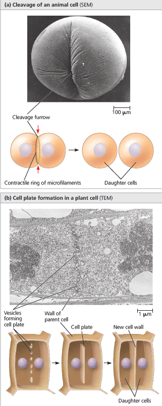

# The Cell Cycle 

Cell division is a process in which one parent cell divides to form two daughter cells (only in mitosis). This happens depending on the type of the cell whether it'd be a prokaryote or eukaryote. Cell division is simpler in prokaryotes than eukaryotes because they have a single circular chromosome, no nucleus and few other organelles. Eukaryotic cells in contrast, have a nucleus and a whole endoplasmic system which makes things more complicated. All of these cell parts must be duplicated and then separated when the cell divides. This division is just one of the multiple things a cell undergoes during its lifetime.

The cell cycle itself is an ordered series of events involving multiple stages of the cell's life, it involves cell division, as mentioned before and the entire cell growth stage and its life cycle. It has two major phases, the interphase and the mitotic phase, during the interphase, the cell grows and the amount of DNA is replicated, but the number of chromosomes stays the same. During the mitotic stage, the replicated DNA and cytoplasmic contents are separated and the cell divides. The mitotic stage in eukaryotes both includes mitosis and cytokinesis (the full splitting and duplication of organelles in the two daughter cells).

The typical cell cycle is divided into four main stages or phases Gap 1 (G1), Synthesis (S), Gap 2 (G2) and either Mitosis or Meiosis (M). G1, S, G2 are collectively called interphase. Gap 0 (G0) is also a cell phases. The phases excluding M are known as the interphase which occupies 90% of the entire cell cycle.
# Growth Phase 1 / Gap 1 (G1)

G1 is named like this due to scientists expecting it to be an actual empty space due to there being little change in G1. This gap takes around 5-6 hours (although it varies in all cells). In contrast to what biologists thought, it's quite active at the biochemical level. As the cell is accumulating the building blocks of chromosomal DNA and the associated proteins, as well as energy reserves to replicate each chromosome in the nucleus. During this stage especially, the cell goes through a rapid growth and performs its routine functions. During this phase, the biosynthetic and metabolic activities of the cell occur at a high rate. The synthesis of amino acids and hundreds of thousands or millions of proteins that are required by the cell occurs during this phase. This is a lagging phase.

# Resting Phase / Gap 0 (G0)

The G0 phase is a resting phase where the cell has left the cycle and has stopped dividing. Cells enter this stage post-G1 and can exit this stage. Cells that are completely differentiated may also enter G0. Some cells stop dividing when issues of sustainability or viability of their daughter cells arise, such as, DNA damage or degradation (cellular senescence). This happens when diploid cells lose the ability to divide, normally after about 50 cell divisions. This happens in cardiac muscle (heart) and nerve cells, this happens due to their specialization.

# Synthesis Stage (S)

During the interphase, the nuclear DNA remains in a semi-condensed chromatin configuration (since this isn't prophase), it starts duplicating the amount of genetic material present in the nucleus according to the leading strand. It also leads to the formation of identical copies of each chromosome whose chromatins or chromatids are firmly attached to the centromere.

Up to this stage, each singular chromosome is made up of these long DNA chains (chromatids) (wrapping on histone proteins.). The centrosome also gets duplicated during this process (which is essential as it has to do with cell movement systems). They majorly help in cell division, and they organize it. They're not present in many eukaryotic species such as plants (Whose mitotic spindles synthesize due to condensation of the cytoplasm) and fungi (the mitotic spindles originate from within the nucleus).

Each chromosome has another chromosome identical to it and the chromatids forming them are called sister chromatids.

The synthesis stage occupies the largest portion of time in the cell cycle where it takes up to 10-12 hours to complete.

# Growth phase 2 / Gap 2 (G2)

In the second growth phase, the cell replenishes its energy store and synthesizes the proteins necessary for chromosome manipulation. Some cell organelles are duplicated to be distributed in the new cell copies and the cytoskeleton is dismantled to be used as resources for the upcoming mitotic spindles and the microtubules used for the M stage (Mitosis) are assembled.
The movement of the centrosomes to the two poles takes place in late G2.
Quality control for the produced DNA in the S stage is performed for the DNA to check for its integrity.

# Checkpoints (For checking if each phase has done its job properly)

# The Exit M Checkpoint

Before the cell enters the G1 phase of the interphase, the cell goes through this checkpoint to assure that the cell has divided correctly and to check if the centrosomes are aligned properly with the mitotic spindles.

# The Enter S Checkpoint (Exit G1 Checkpoint)

Before the cell commits to the S stage, the cell should check nutritional state of the cell and check the resources for DNA replication as well as the integrity of the DNA itself.

	In yeast, the cell checks its own size to see if it's ready to enter the S stage.

The exit S/Enter G2 Checkpoint is performed at the beginning of the G2 phase. G2 usually takes around 4-6 hours to complete.

# Mitosis Stage (M)

To make two daughter cells, the contents of the nucleus and the cytoplasm must be divided. In summary, the Mitosis stage is the condensation of chromatin reticulum into chromosomes, the disappearance of the nuclear envelope and nucleolus, the movement of the chromosomes to the two poles and the formation of two daughter cells containing the same number of chromosomes as the parent cell (2N). Mitosis is divided into two parts, the first part is the main FIVE stages which are prophase, prometaphase, metaphase, telophase and anaphase, the second part is cytokinesis which is the physical splitting of the two daughter cells by the cleavage furrow.

Mitosis' first part (also known as karyokinesis) is divided into 5 phases, Prophase, Prometaphase, Metaphase, Anaphase and Telophase. The following part of Mitosis is called Cytokinesis.

In Karyokinesis' prophase the chromosomes finally condense by tightly condensing chromatin fibers, the spindle fibers extend from the centrosomes, the nucleoli disappear, the centrosomes move towards the opposite poles, the nuclear envelope starts to dissociate into smaller vesicles, the membranous organelles fragment and disperse towards the periphery of the cell, the centrosomes begin to move away from eachother, by the lengthening microtubules between them and they have radial arrays of shorter microtubules that extend from the centrosomes called asters ("stars").

In the prometaphase, a protein structure is developed on each sister chromatid called a kinetochore in the centromeric region, the nuclear envelope is fully broken down and chromosomes are attached to microtubules from both poles of the mitotic spindle each at the kinetochores invade the nuclear area, chromosomes condense even more (95%) and the microtubules not interacting with the kinetochores are called nonkinetochore microtubules and perform the lengthening of the cell.

In the metaphase, the centrosomes are at the opposite poles of the cell, the chromosomes have arrived to the metaphase plate and align, this plate is equidistant to the spindle's poles, the chromosomes' centromeres all lie at this plate and the chromosomes maximally condense (100%).

The anaphase is one of the shortest stages of mitosis, often lasting only a few minutes, anaphase begins by the cohesin proteins which are cleaved by an enzyme called separase, this allows the two sister chromatids to part suddenly and each chromatid becomes an independent chromosome therefore giving the 2N chromosomal composition for the daughter cells by using motor proteins along the microtubule to decompose the microtubule, the separated daughter chromatids become daughter chromosomes and they begin moving towards the two opposite poles of the cell as their kinetochore microtubules begin to shorten moved at a rate of about 1$\micro m/min$, the cell elongates further as the nonkinetochore microtubules lengthen and by the end, the cell has two ends of identical and complete collections of chromosomes.

In the telophase, the two daughter nuclei form in the cell as the nuclear envelope starts reemerging and so do other portions of the endomembrane system (in a eukaryote), the nucleoli reappear, the chromosomes become less condensed, any remaining spindle microtubules are depolymerized and used as resources to build other cytoskeleton members and the mitosis is finally complete which takes around one hour.

In the second part of mitosis which is cytokinesis is the formation of a cleavage furrow which pinches the cell into two cells and the two daughter cells appear shortly post-end of mitosis.

During cytokinesis, the cleavage furrow is a shallow groove in the cell surface near the old metaphase plate. On the cytoplasmic side of the furrow is a ring of actin microfilaments associated with molecules of the protein myosin. The actin microfilaments interact with the myosin molecules, causing the ring to contract. In plant cells, there is no cleavage furrow, instead during telophase, vesicles from the golgi apparatus move along microtubules to the middle of the cell where they condense and produce a cell plate until forming a complete cell wall. 
