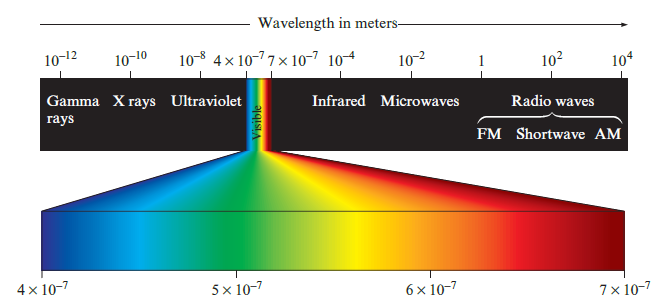
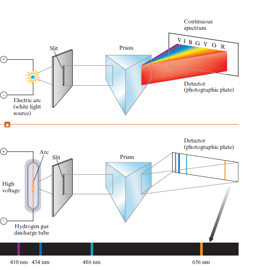
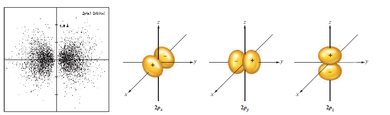
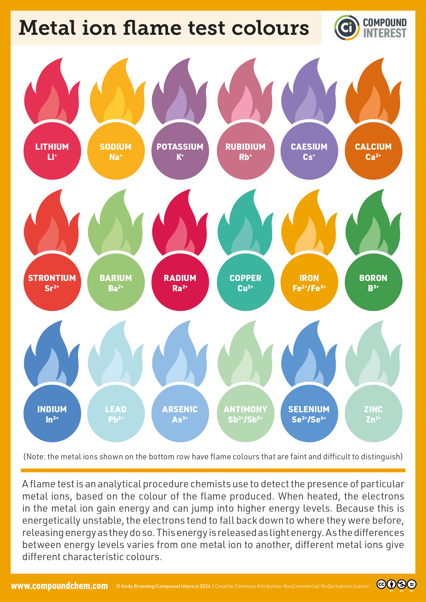

The entirety of this Learning Outcome talks about electromagnetic radiation, waves and their properties so prepare yourself with prep 2 physics n stuff.

> [!abstract] 
>  # **Electromagnetic Radiation**

Electromagnetic radiation is one of the ways that radiation transmits energy in space, for example like the light from the sun, X-Rays, radio-waves, microwaves and even the heat from a fireplace is due to electromagnetic radiation. Scientists have noticed that they have some wave behavior, and travel at the same speed (light speed (3x108 or 2.9979x108)) through a ====vacuum====.

Waves have three primary characteristics that are used to describe and represent the wave, wavelength, frequency and speed. Wavelength (*symbolized by the lowercase Greek letter lambda $\lambda$*) is the distance between two crests or troughs in the mechanical wave.

The frequency (*symbolized by the lowercase Greek letter nu $\nu$*) is the amount of cycles completed in a unit time (Seconds, and usually the frequency itself is measured in Hertz (Hz)) and can be measured with s-1 (s meaning the periodic time which is the time taken to finish one cycle) (<em>14 s-1</em>).

From the last two observations we can deduce that frequency and wavelength are inversely proportional, as the distance between two crests and troughs increases, the frequency decreases. Meanwhile as the frequency increases this means that the wavelength is relatively little because all waves are close to eachother.
All types of electromagnetic radiation travel at the speed of light in a vacuum.

The relation between wavelength, frequency and light speed is pretty straight forward as:
$\lambda \nu = c$ Where $\lambda$ is the wavelength in meters, while $\nu$ is the frequency in hertz.

Electromagnetic waves have different wavelength which is what differentiates one from another, refer to the following image:

At the end of the nineteenth century, the idea of matter and energy being different was a thing, where they thought matter consisted of particles and energy in the form of electromagnetic radiation as a wave, they were described as massless and detached, while particles were described as things that had mass and position in space could be specified.

The German physicist Max Planck in 1900 came in and fixed this through certain experiments. He studied the radiation emitted by solid bodies heated to a bright light. Planck found that the results could not be explained by physics of his day, which stated that matter could absorb or emit any quantity of energy. 

Planck was accredited for those observations only by postulating that energy can be gained or lost in whole number multiples of the quantity $h\nu$ where $h$ is a constant called Planck's constant which from the experiment was determined to have a value of $6.626$x$10$-34 $J \cdot S$ Where J is Joules and S is seconds. 

The change of energy in a system, $\Delta$E can be represented by the equation:
$\Delta$E = $nh\nu$ where $n$ is an integer, $h$ is Planck's constant, $\nu$ is the frequency of the electromagnetic radiation absorbed or emitted, $n$ is the number of photons or at other times, $n$ is the energy level count (incase of electrons).

The following development was that in the context of atomic structure, Einstein proposed that electromagnetic radiation is quantized (consists of photons).

Einstein suggested that electromagnetic radiation could be viewed as a stream of "particles" (which were later derived to be waves, although they can have both properties (Refer to the Quantum Theory)) called photons. The energy of each photon is given by the expression:
$E$photon = $h\nu$ = $\dfrac{hc}{\lambda}$  Where, yet again $h$ is Planck's constant, $\nu$ is the frequency of the radiation and $\lambda$ is the wavelength of the radiation.

> [!abstract] 
>  # **Photoelectric effect**

Einstein reached the $E$photon conclusion through his analysis of the photoelectric effect (he won a Nobel prize for this), the photoelectric effect points to the phenomenon in which electrons are emitted from the surface of a metal when light strikes it, The following observations characterize the photoelectric effect:
1. Experiments where they tried different frequencies of light showed that no electrons are emitted by the metal if the frequency is below a threshold frequency $\nu$0 
2. The light below this threshold frequency emits no electrons regardless the intensity of the light or increasing of photons.
3. For light with frequency higher than or equal to the threshold frequency, the number of electrons emitted increases with the intensity of the light.
4. For light with frequency higher than or equal to the threshold frequency, the kinetic energy of the emitted electrons increases linearly (in a straight line in a graph) with the frequency of light.
These observations can be explained by assuming that electromagnetic radiation is quantized (consists of photons), and that the threshold frequency represents the minimum energy required to remove the electron from the metal's surface.

Minimum energy required to remove an electron would be: $E$0 = $h\nu$0 
Because a photon with energy less than $E$0 cannot remove an electron, light with a frequency less than the threshold frequency produces no electrons, meanwhile if it has a higher frequency (Therefore more energy) it gives the excess energy to the electron in the form of Kinetic Energy.

$KE$electron = $\dfrac{1}{2}mv^2$ = $h\nu$ - $h\nu_0$ where $m$ is the mass of the electron ($9.11 * 10^{-31}kg$), $v$ is the velocity of the electron, $h\nu$ is the energy of the incident photon and $h\nu_0$ is the energy required to remove an electron, this is because the intensity of light is a measure of the number of photons present in a given part of the beam, a greater intensity means more photons are available to release more electrons (as stated, as long $\nu$ > $\nu_0$).

Einstein said that light is a particle that has the flow of a wave.

In another development, Einstein derived the famous equation
$E = mc^2$
The main significance that this equation has is that any energy has mass, from the way he derived the formula we can manipulate it:
$m = \dfrac{E}{c^2}$ where c is still speed of light, m is mass and E is energy.
Using that form of the equation, we can calculate the mass associated with a quantity of energy, for example: we can calculate the apparent mass of photons (قال يعني). For calculating $E_{photon}$ with wavelength and no frequency then you'll get $E_{photon} = \dfrac{hc}{\lambda}$ 
Substituting this in $m = \dfrac{E}{c^2}$ you get: $m = \dfrac{hc/\lambda}{c^2} = \dfrac{h}{c\lambda}$.

Physicist Arthur Compton performed experiments involving collisions of X-rays and electrons, that showed that photons do have the mass resulting from the previous equation.

To summarize what Einstein and Planck concluded, they said that energy is quantized, it can only happen in specific units called quanta, they also concluded that ERs show characteristics of particle matter as well, this phenomenon is called the duality of light. (dual nature of light).

But is the vice versa of the previous true? Does a particulate matter have wavelike properties? French physicist Louis de Broglie asked that same question to himself, he answered the question by remembering the relationship between wavelength and mass.
Where $m = \dfrac{h}{v\lambda}$ turns into $\lambda = \dfrac{h}{mv}$ which allows us to calculate the wavelength for a particle. He in fact did find that any particle also has wavelength.

>[!abstract] 
># Energy emission of Hydrogen

Bohr had derived an energy emission equation from hydrogen that ONLY works for mono electron systems for the sole reason that it considers the interactions between one electron and the nucleus.
$E=-2.178*10^{-18}J(\dfrac{Z^2}{n^2})$  where Z is the nuclear charge (1 in a mono electron system) and n is an integer indicating the energy level where the larger the number, the larger the orbit radius, J is Joules. The negative sign in this equation indicates that this energy is lower than it would be if the electron were at an infinite distance from the nucleus (n=infinity) (proves quantization).
The change of energy is dependent on the before state and after state, where:
	$\Delta E=E_{Post}-E_{Pre}$ where $E_{Post} = -2.178*10^{-18}(\dfrac{1^2}{n_{Post}^2})$ $E_{Pre} = -2.178*10^{-18}(\dfrac{1^2}{n_{Pre}^2})$, therefore, $\Delta E=-2.178*10^-18J(\dfrac{1}{n_{post}^{2}}-\dfrac{1}{n_{pre}^2})$, if the n = 1, then the energy required to remove the electron directly is $2.178*10^{-18}J$ 

We may also calculate the quantized energy of an electron using:
$E_e = \dfrac{-2.178*10^{-18}J}{n^2}J$
This also denotes the ionization energy of that electron in a hydrogen atom at a different energy level than the base ground (n=1).
We can find the wavelength of the photon that the electron emitted by falling into a lower energy level or the wavelength the photon absorbed by jumping into a higher energy level.
$\dfrac{1}{\lambda}=R(\dfrac{1}{n_{Post}^2}-\dfrac{1}{n_{Pre}^2})m^-1$ where R is the Rydberg constant (this is called Rydberg's equation), R is denoted $R_\infty$ on the calculator.
Notes:
1. Any electron emitted from n $\geq$ 2 to 1, then the wavelength belongs to ultraviolet rays. (Lyman series).
2. Any electron emitted from n $\geq$ 3 to 2, then the wavelength belongs to visible light. (Balmer series).
3. Any electron emitted from n $\geq$ 4 to 3, then the wavelength belongs to infrared rays. (Paschen series).

 >[!abstract] 
># The atomic spectrum of elements otherwise known as the emission spectrum of elements. 

This is an interesting part, because when a photon or a beam of light, as mentioned before hits the atom, it removes the electron and it flies out, causing the atom to gain energy and be in an excited state, for example H2 molecules absorb energy and some of the bonds are broken, the resulting hydrogen atoms are excited, they contain excess energy, they release said energy by emitting light, as stated before by gamma rays, an excited atom may release invisible gamma rays to lose some energy.

The emissions have a certain wavelength and aren't always the same, and nor are they in an enclosed interval therefore only making a line that represents the wavelength of the emitted light from the electron, this is called a line spectrum, this indicates that only certain energies are allowed for the electron in a hydrogen atom, it completely validates Planck's hypotheses in the last section.

In classical physics, it's said that a charged particle (For example, the electron) under acceleration should radiate energy, since an electron revolving around the nucleus constantly changes its direction, it is constantly accelerating, therefore it radiates energy in the form of light and loses energy, therefore being attracted to the nucleus.

Now, you know quantum numbers, quick revision.
The main energy level is written to the left of the sublevel, ex: 2p which is n 
the subsidiary quantum number or the angular momentum quantum number or the secondary quantum number or the azimuthal energy level whatever you wanna call it, has the number of the sublevel, s is indexed as 0, p is indexed as 1, d is indexed as 2, f is indexed as 3.
now, ml is the magnetic quantum number, and this is which orbital this electron is stored in, for example: 3p4 and we consider getting the last electron then, n = 3, l = 1, ml = -1 (ranges between -l to l in a closed interval) calculated by $n^2$ or $2l+1$, each orbital carries two electrons.
ms which is the magnetic spin quantum number, is the direction of the electron whether it'd be up or down in this case it'd be down (-1/2) and up is (1/2).

Each orbital has a shape, which is clearly represented by a probability distribution because electrons aren't always in that place, other than they're also instantaneous, you can never find the current position of an orbiting electron. The s sublevel for example is spherical, but as you increase the energy level, you get a higher amount of something called nodes which is generally how big the next energy level is, number of total nodes is n - 1, number of radial nodes is given by n-l-1, number of angular nodes is given by l.

An orbital in 2p looks like two irregular peas squished into eachother, or a dumbbell. 

Meanwhile the 3p orbital adds another node to those, so they look like a sound wave (Sort of)

3d looks like four beans attached to eachother, dz^2 looks weird like a wormhole.

# Some restrictions relating to the quantum numbers

**Pauli's exclusion principle:** which states that no two electrons can have the same four quantum numbers $n, l, ml, ms$.

**Hund's rule:** Orbitals may have identical energy levels when they're of the same principal shell. These orbitals are called degenerate, or "equal energy". Electrons fill orbitals one at a time, one up and one down and it seeks to fill all the orbitals with similar energy.

**Aufbau Principle**: The lower energy orbitals are filled before the higher energy orbitals.

**Heisenberg's uncertainty principle:** We cannot precisely measure the momentum and position of an electron at the same time. As the momentum is more and more certain, the position becomes less certain and vice versa. This is why $n$ belongs to $Z$. If there were partial waves, they wouldn't work well with complete waves as they'd cancel eachother out.

> [!abstract] 
>  ## Valence numbers 

Valence numbers are the electrons gained or lost in a chemical reaction, different from the valence electrons, which is the number of electrons in the outer shell.

> [!abstract] 
> # Absorption of photons

An element called a spectrophotometer is an instrument that measures the amount of photons absorbed by an electron, it's exactly when a photon or two with a certain frequency to change the energy state of the atom from ground state to a higher state, the inverse happens in emissions, emissions cause the electron to decrease in energy levels.

> [!abstract] 
>  # Flame tests

Flame tests are generally an easy concept because you take whatever compound/element you want and burn it to see the abundancy percentage or see a wavelength or emission speed or whatever, each metal burns with a specific color, for example strontium's burning color is bright red, called strontium red.
This happens because the heat of the flame excites the electrons of the metals causing them to emit visible light.

To finish off:
# The excited state of the atom.

This means that the atom or molecule or nucleus is in an energy condition more than the ground, offset state. Excitation refers to the increasing of an energy level above the starting point (ground state or an excited state, depending on the question), the temperature also must be taken into consideration here.

The lifetime of a system in an excited state is usually short, spontaneous or induced emissions, spontaneous emissions meaning it lost some energy and released a quanta or quantum meanwhile induced emissions meaning that an incident photon hit the electron and caused it to bounce to a lower energy level, losing its energy and releasing it as an image of a photon with a different wavelength, only: frequency, polarization and light direction are like eachother in incident and reflected photons.

The decrease of energy is also known as decay and is the inverse of excitation.

Atomic excitation can be achieved by high heat, for example the hydrogen atom.
The ground state of a hydrogen atom is the single electron in the lowest possible orbital.

If the electron has too much energy it will cease to be bound to the atom and the atom will become ionized (lose an electron or more therefore being a positive ion), after the excited state the atom may return to a lesser state of excitement or the ground state by emitting a photon in the form of emission lines.

The term for a high excited state atom is Rydberg atom.
