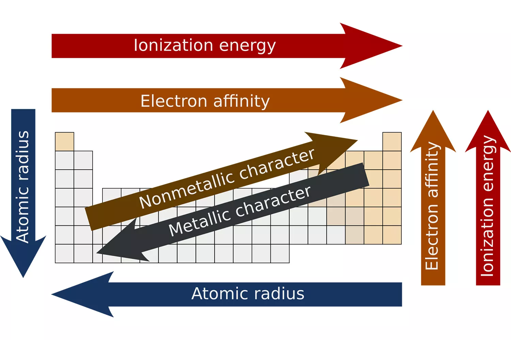

> [!todo] 
> Compare between metals, nonmetals and metalloids, as well as the alkaline metals group and the halogens group. 

> [!abstract] 
> # Structure of the periodic table 

The periodic table, also known as the periodic table of elements is an ordered arrangement of the currently known elements, they're classified into groups (columns) and periods (rows), it is an application for the periodic law which states that by ordering elements by their atomic numbers you get a recurring properties pattern.

The periodic table is divided into four almost rectangular shapes called blocks, where the first block to the very left (alkaline and earth alkaline metals block) is called the s block, which includes Hydrogen and Helium, to the very right is a block called the p block which contains halogens, metalloids, post-transitional metals and noble gases, the d block which contains the transitional metals, and finally the f block which contains the lanthanoids (lanthanides) and actinoids (actinides) which appear at periods 6 and 7.

Although, these numbers aren't constant as they can change at any time due to the discovery of a new element in any case, the periodic table would have to get changed up and the periodic law would be broken as the new elements won't exactly have the properties of the groups therefore making the periodic law become a periodic theory.

Each chemical element has a unique number (Z, for "Zahl" in German for number) which is the atomic number which represents the number of protons in the nucleus.

Periodicity and Trends in the periodic table represent the repetition of a certain trend across the entire periodic table, for example if this group contains elements that have a high metallic luster then this trend repeats every period.

The trend in general can be based off of: size, electronic properties, electronegativity, ionization energy, electron affinity, atomic radius, melting point and metallic character.

Old scientists used this way as a tool to determine/predict the properties of an element in a group.

For example, the atomic radius in this case which contradicts the electronegativity (As the atomic radius increases, the electronegativity decreases), is one half the distance between the nuclei of two atoms, atomic radius' trend is that it decreases from left to right because all electrons are added to the same shell, but also protons are being added more than the electrons, which gives a higher nuclear attraction, if we also go down a group to the left, atomic radius increases.

We also have the ionization energy, which is the energy required to remove an electron from a neutral atom in its gaseous phase, technically, ionization energy is the opposite of electron affinity (Ability to gain an electron), the higher ionization Energy is, the more readily the atom becomes a cation, elements which have a high ionization energy are to the right side of the periodic table because their valence shell is nearly filled, while to the left have low ionization because they want to lose electrons and become cations.

It's also affected by electron shielding which describes the atom's inner electrons to shield the nucleus from the valence electrons. When going to the right of the periodic table the shielding strength increases and therefore it is easier for the valence shell to ionize, therefore ionization decreases down a group, electron shielding is also named screening.

Electronegativity is the atom's ability to attract and bind with electrons and other atoms, electronegativity is a quantized quantity therefore it doesn't have any measuring unit or a standardized method for calculating electronegativity, however there's a relative scale of it called the Pauling scale, since atoms to the left of the periodic table have less than a half-full valence shell, the energy required to gain electrons is significantly higher compared with the energy required to lose electrons.

However elements on the right side of the tables are more energy-efficient in gaining electrons to create a complete valence shell, electronegativity increases by going up right.

The electronic affinity of an atom is the ability of an atom to accept an electron, unlike electronegativity, electron affinity is a quantitative measurement. It's the change in energy of a neutral atom when an electron is added to the atom to form a negative ion, whose measuring unit is kJ/mole, electron affinity is the ability of an atom to gain an electron rather than lose one (ionization energies.).

Electronic affinity generally decreases down a group of elements because each atom is larger than the atom above it. (Atomic radius trend, by going down, radius increases). 
This means that an atom with a high atomic radius has more ionization energy than electronic affinity because it wants to lose those electrons and become a positive ion, with a smaller distance this causes the nucleus to have greater attraction abilities, therefore increasing electronic affinity from left to right of the periodic table, from bottom to up, therefore Fluorine is the most electronically affinage, because it has a small atomic radius and is at the top of the last group.

> [!important] 
>  # Comparison between metals, non-metals and metalloids.

| POC                                | Metals                                                                                                                                                                   | Metalloids                                                                                                             | Non-Metals                                                                          |
| ---------------------------------- | ------------------------------------------------------------------------------------------------------------------------------------------------------------------------ | ---------------------------------------------------------------------------------------------------------------------- | ----------------------------------------------------------------------------------- |
| Element No.                        | 88                                                                                                                                                                       | 11                                                                                                                     | 22                                                                                  |
| Luster                             | Lustrous and have a bright surface                                                                                                                                       | Have moderate luster (sometimes)                                                                                       | Submetallic  (Almost no reflective, nice luster) and dull.                          |
| Conductivity                       | Highly conductive, electrically and thermally                                                                                                                            | Somewhat conductive, like Silicon (Si) as it's conductivity depends on the heat. Thermally intermediate.               | Have almost no conductivity (Except for graphite (electrically))                    |
| Ductile and malleable              | Yes                                                                                                                                                                      | Sometimes but mostly brittle and breakable                                                                             | No                                                                                  |
| Melting and boiling points         | High melting points (except Mercury Hg)                                                                                                                                  | Lower than metals                                                                                                      | Low                                                                                 |
| Density                            | High                                                                                                                                                                     | Intermediate                                                                                                           | Low                                                                                 |
| Ionization energy                  | Low because metals have a large atomic radius if you go to the left especially when going down it makes an electronic shield (Screen) which decreases ionization energy. | Intermediate                                                                                                           | High                                                                                |
| Electronegativity                  | Low where they do not readily share electrons, their vapors are monoatomic                                                                                               | Intermediate, they readily share electrons even in the normal form                                                     | High, they readily share electrons and form diatomic, large molecules.              |
| Results when combining with metals | Makes an alloy with a certain percentage of the combined elements                                                                                                        | Also makes an alloy                                                                                                    | Ionic compounds by losing and gaining electrons (usually through a redox reaction.) |
| Reaction with oxides               | Stronger basic oxides or weaker acidic oxides                                                                                                                            | An amphoteric result (can react both as a base and an acid) or cause a weakly acidic compound                          | Acidic compounds or general compounds.                                              |
| Electronic configuration           | Usually have 1, 2, 3 electrons in the outermost MAIN energy shell.                                                                                                       | Usually are intermediate and have 4 electrons in the outermost MAIN energy shell (Except Carbon)                       | Usually have 5, 6, 7 electrons in the outermost MAIN energy shell.                  |
| Redox reactions/Ionization         | Lose electrons, therefore they become oxidized and a cation.                                                                                                             | Can both lose and gain electrons, therefore having both chances to be oxidized and reduced to be a cation or an anion. | Gain electrons to become reduced an a anion.                                        |
| Reaction with H2O       | React with water forming metal oxides or metal hydroxides and release hydrogen which burns with a popping sound.                                                         | Unreactive                                                                                                             | Unreactive                                                                          |
| Reaction with other salt solutions | React with the salt solution to replace metals which are weaker than it in the C.A.S                                                                                     | Unreactive                                                                                                             | Replace some things in the compound for example halogens can replace eachother.     |
| Defining properties                | Technically corrosion and high-melting points are a defining feature since non-metals can't corrode.                                                                     | Mixed properties from both non-metals and metals.                                                                      | Their relative inactivity and diatomic molecules.                                   |

We can also compare between the 1A group (alkaline metals) and the 7A group (Halogens group)

We can say that group 1A which is group 1 is called the alkaline group because it has elements which form alkalines.

Group 7A is also called the halogens group, both of these groups are highly reactive especially when one another is found as both of these groups like reacting as long as the alkaline metal and the halogen are in one period to make an ionic compound.
Group 1A has the element with the biggest atomic radius (Cesium). While group 7A has the highest electronegativity (Fluorine).

Group 1A elements react by losing their outermost electrons as they're metals and as usual lose electrons to reach the *last nearest* inert gas configuration, while group 7A gains electrons until it's the *next nearest* inert gas, group 1A elements also like replacing eachother according to the C.A.S as well as the halogens in group 7A where the fluorine likes to replace the iodine, chlorine, astatine, etc.
They're also called halogens because they like to form salts with metals, while group 1A is called alkaline metals because they like to make alkalines when reacting with water.

Group 1A also, has low ionization energy with low electron affinities meanwhile group 7A have high ionization energy and electron affinities too.
