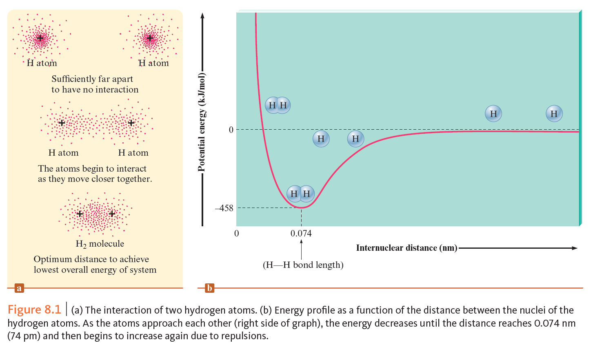
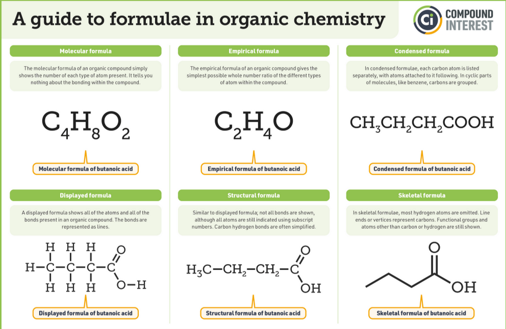
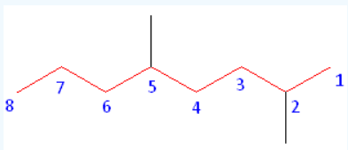

Now, I'll be talking about bonds, think for a little bit, I want you to ask yourself how a piece of graphite and diamond are so different yet so similar? They're both made of carbon atoms yet are quite different in physical characteristics (especially) and chemical characteristics, we also find it common that everything around us is composed of bonds and formations (some exceptions, such as Argon and Helium in the atmosphere or mixed with natural gas reserves).

Silicon and Carbon are also in group 4A, you'd expect them to be similar in a compound or even standalone but you'd be mistaken as for example SiO2 and CO2 are extremely different, where the first one is the chemical composition of silica and quartz, while the second is a result of combustion and a product of respiration, the reason why they're so different is due to the way of bonding between the atoms.

What even are bonds? Bonds are a force that attract atoms together depending on charge or other reasons that cause it to form weak or strong relations with the other atom.

The energy of each bond determines how strong or how hard it is to pull apart, which can be gotten through *Coulomb's law* which is a law in electrophysics that determines the energy (in this case, the energy of interaction between the ions or the atoms, with their charge.)
This law states as follows: $E=(2.31*10^{-19} J\cdot nm(\dfrac{Q_1 Q_2}{r}))$ where E is the energy, measured in joules, r is the distance between the ion centers in nanometers (it's too little anyway) and Q1 and Q2 are the values of electrical charges in numerical ion charges.
For example in an NaCl compound, the distance between their centers is 0.276nm and the Q1 charge is +1, the Q2 charge is -1, therefore: $E=(2.31*10^{-19} J\cdot nm(\dfrac{(+1) (-1)}{0.276nm}))$ therefore E = -8.37 * 10-19 Joules.

We can use the previous to also calculate the repulsion energy for two like charges. Let's take for example in the repulsion attraction situation, when you have terms you have either like or opposite terms in according to charge, proton-proton repulsion, electron-electron repulsion or electron-proton attraction. (last one is the favorable term, all the previous are due to the attraction of hydrogen atoms).

Naturally, things tend to achieve the lowest energy or have the most stable form, therefore when the two aforementioned hydrogens, in which case the hydrogens would naturally tend to positioning themselves in a chained form where they have the least amount of energy in a certain distance, this is called the bond length. 

# Nomenclature (the naming) of compounds

In general forms, alkanes can be attributed to single bonds, alkenes or also known as alkylenes can be attributed to double bonds, alkynes can be attributed to triple bonds, (use the suffix from the ends of these alka- prefixes in the naming of the compound (in the suffix, as:)). For example: Hex**ane**, But**ane**, Pent**ene** or Pent**ylenes**.

Alkanes have a chemical formula of $C_nH_{2n+2}$, Alkenes have a chemical formula of $C_nH_{2n}$, Alkynes have a chemical formula of $C_nH_{2n-2}$. The prefix for the compound should be deduced according to $n$ which is the number of satisfied Carbons, where:

| 1.  | Meth- |
| --- | ----- |
| 2.  | Eth-  |
| 3.  | Prop- |
| 4.  | Bute- |
| 5.  | Pent- |
| 6.  | Hex-  |
| 7.  | Hept- |
| 8.  | Oct-  |
| 9.  | Non-  |
| 10. | Dec-  |
Also, Alkynes are more active than Alkenes and Alkanes, Alkenes are more active than Alkanes.

Alongside Alkynes, Alkenes and Alkanes, there are Alkyls which always have an odd number in the chemical composition where: $C_nH_{2n+1}$.
# Naming according to the structure

The principle for naming according to structure is:
1. Finding the longest chemical chain
2. Finding the branches of the main chain
3. Finding the closest branch incase of an Alkane or a single bond or finding the closest double or triple bond in Alkenes or Alkynes.
What does any of that mean?
Let's imagine a skeleton structure formation (most described one is the displayed formula from the full chemical structure, most sophisticated is the skeleton structure)

When ordering after finding the longest chain, you should order from the least functional pair or the substitutes present (Fluoro, Bromo, Nitro, etc.) which gives you the ordering direction of the chain, from which you can define the names according to the carbon atom's position and its branch, if any.

You should also order according to the alphabetical order, so your end result would be something like "2-Br-6-Cl-Heptane".

# Isomers

Isomers are the same chemical compound with the same formula but a different chemical arrangement, they can be caused by multiple things.

