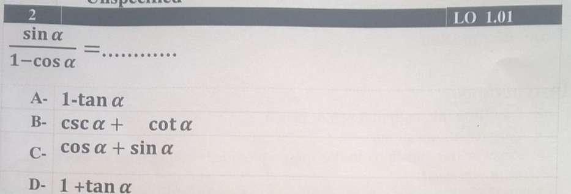
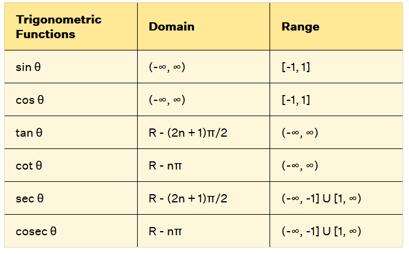

We should be able to differentiate between identities and equations, where equations can be a real, definite answer in one set, while identities are always applied and are always true, they also have a proof for them.

In the unit circle, we know that the general circle equation is $x^2 +y^2 = r^2$ where r is equal to one (in the unit circle.)
We can substitute the x for $cos\Theta$ and the y for $sin\Theta$, therefore: $sin^2\Theta + cos^2\Theta = 1$, we can also get two more identities from $x^2+y^2=1$ by dividing by $x^2$ and getting: $1+tan^2(\Theta)=sec^2(\Theta)$, now divide by $y^2$ and get: $cot^2(\Theta)+1=csc^2(\Theta)$. Identities of angles $\Theta to -\Theta$ are called identities of even and odd functions.

Tip for answering questions on trig identities: if there's a complex number in the denominator multiply it by it's conjugate 
This allows you to continue the equation and not reach a dead end, like the following: 
The reason this is unsolvable without a calculator and rationalization is because you'll keep bumping into dead-ends.

We also have two basic sine-cosine functions that can be graphed **I HAD HOPED THAT THE STEM UNIT PUT TRIG FUNCTION GRAPHING IN THE FIRST LO BUT THEY DIDN'T** (I'm writing this because I saw it in an earlier exam).
A basic sine function is as follows: $y = asin(bx+c)$ and a basic cosine function is the same: $y=acos(bx+c)$, we can get some things from these functions such as their period, which is $\dfrac{2\pi}{|b|}$ radians.

We can also find the range for these functions in an interval by simply taking the $a$ variable and plugging it into an interval as follows: $[-a, a]$. $a$ is also considered as the amplitude of the wave function.

The domain in sine and cosine functions is from negative infinity until positive infinity. 
## The x-intercept in the graph for a sine or cosine function is $n\pi$ where $n$ is an integer belonging to the $Z$ set.

# The sine law

Sine law is used to get the angles and lengths of sides in a non-right angled triangle, if the requirements are met in any way.

The sine law: $$\dfrac{a}{sin A} = \dfrac{b}{sin B} = \dfrac{c}{sin C} = 2r$$  
(Although, this raises a case called the ambiguous case).

# The cosine law
In any triangle ABC, 
$$a^2 = b^2 + c^2 - 2bc*cos(A)$$
$$b^2=c^2+a^2-2ca*cos(B)$$
$$
c^2 = a^2+b^2-2ab *cos(C)
$$
Therefore:
$$cos(A)=\dfrac{b^2+c^2-a^2}{2bc}$$
$$cos(B)=\dfrac{c^2+a^2-b^2}{2ca}$$
$$cos(C)=\dfrac{a^2+b^2-c^2}{2ab}$$
The second rule is used if the lengths of the sides of the triangle or the ratio among the lengths are given.

The cosine law is more accurate as it determines the type of the angle whether it is acute or obtuse.

# Cases of a triangle

If the given triangle has one side and has two angles then we may use:
$m(<C) = 180-(m(<A)+m(<B))$ to find m(<C).
You may also use the sine law.

If two sides and an included angle are given then: 
**Use the cosine law** or use the same previous relation.

If the three lengths are given, use the same relation yet again and the cosine law.

If two sides and a measure of an angle opposite to one of them (ambiguous case) then:

We must use geometry to reach to the final conclusion, if a, b and m(<A) are given, then we find h = b sin A and to find the possible solutions, we compare between the lengths
***IN AN ACUTE ANGLED TRIANGLE:***
if ***a < h*** then we ***can't*** draw a triangle, if ***a = h*** then we can draw a ***right-angled triangle.***
if ***h < a < b*** then we can draw ***two triangles.*** if ***a $>=$ b*** then we can draw only ***one unique triangle.*** 

***IN AN OBTUSE OR RIGHT ANGLED TRIANGLE***
No need for the h value, if ***a <= b*** then we ***cannot draw a triangle***, if ***a > b*** then we can draw a ***unique triangle***.

***BUT:***
If:
1. Angle A lies in the first quadrant (if acute) and lies in the second quadrant (if obtuse)
2. The range of the sine function is [-1, 1]
3. If the triangle has an obtuse angle, then the other two angles must be acute angles.
Then we can use the sine rule directly without determining the number of possible triangles.

We can also just solve the triangle by using the cosine rule and the quadratic equation and the number of the triangles is the number of the positive solutions of this equation.

Quadratic equation (General formula):
$X=\dfrac{-b\pm\sqrt{b^2-4ac}}{2a}$ 

Let's say a = 15cm, b = 12cm, and m <A = 94o we can say: $15^2 = 12^2 + c^2 - 2*12*c*cos(94)$ = $c^2+1.67415537c-81=0$ 
$X_1\approx 8.2$ while $X_2 \approx -9.9$ , since there's only one positive answer then we can only get one solution.

Fun fact: $b^2-4ac > 0$ means that we have 2 solutions, if $b^2-4ac = 0$ then we have only one solution, if $b^2 -4ac < 0$ then we have no solutions.

If the equation has one solution, the formula is reduced to $X = \dfrac{-b}{2a}$ 

# Heron's formula

Heron's formula found that for any triangle, if we have the three sides and no angles, we can get it's area or the radius of the inscribed circle.

Heron's formula requires the perimeter and the measure of each side or at least the ratio between each side (you may write a=3x).

It states that: $\sqrt{S(S-A)(S-B)(S-C)}$  = The area of the triangle, where S is the semiperimeter (the half of the perimeter).

We can also use this to find the radius of a circle inscribed inside of a triangle, given its perimeter and area, we can get the semiperimeter and area therefore the radius will be equal to: Area/Semiperimeter = r