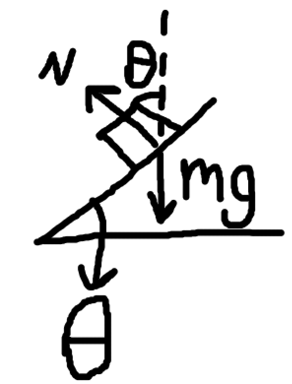

some laws i derived while answering some questions lmao

$tan\theta = \dfrac{a}{g}$, substitute for centripetal force $tan\theta = \dfrac{v^2}{gr}$ , this is to get the angle between something and the vertical imaginary extension of the weight in a slanted system like the following:

it can also equal to $gsin(\theta)=a$ on an inclined slope like the previous (i dont know what equation is better but both provide close results)
in a pulley system, the acceleration is $a=\dfrac{g(m_2-m_1)}{m2+m1}$ where m2 is the heavier object and m1 is the lighter

and the tension force is found by substituting a into any of the two objects' equations
$T=\dfrac{2m_1m_2g}{m_1+m_2}$ 

in a pulley system, both y and x accelerations should be the same, also equations should probably be derived, also when getting acceleration or tension, you divide by the entire mass of the system (assuming pulleys are massless and frictionless). what i usually do is get the net force, translate it into newtons second law and say that $a=\dfrac{\Sigma F}{M}$ where M is the sum of the masses in the system, sigma f is the sum of forces atleast in this axis.