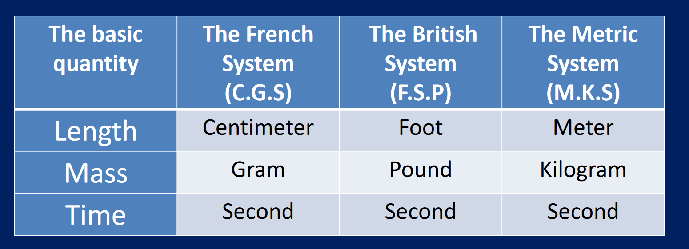
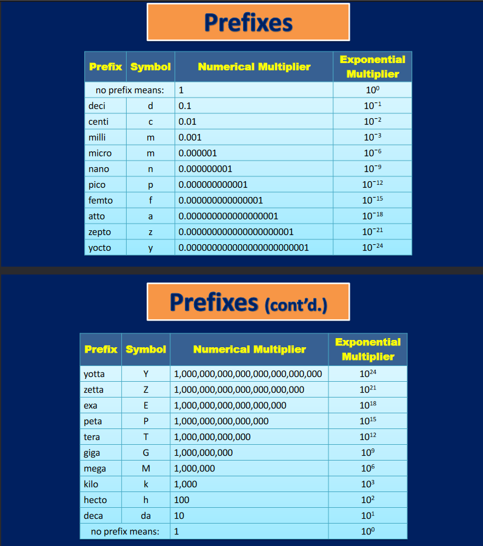
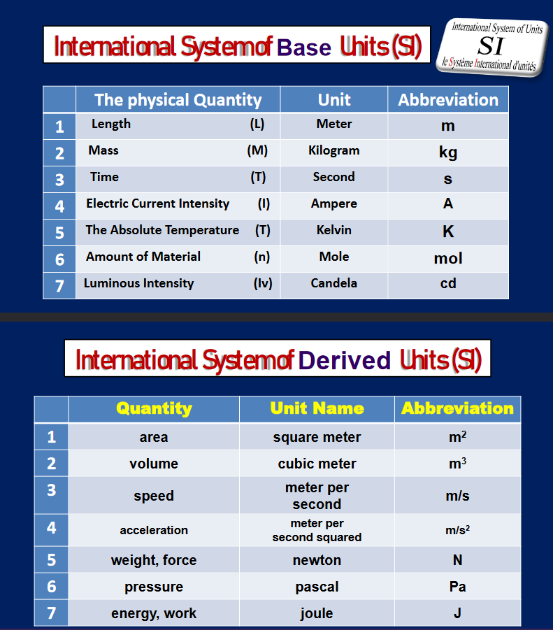
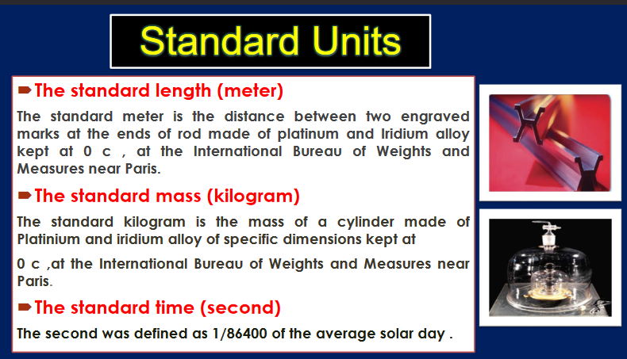
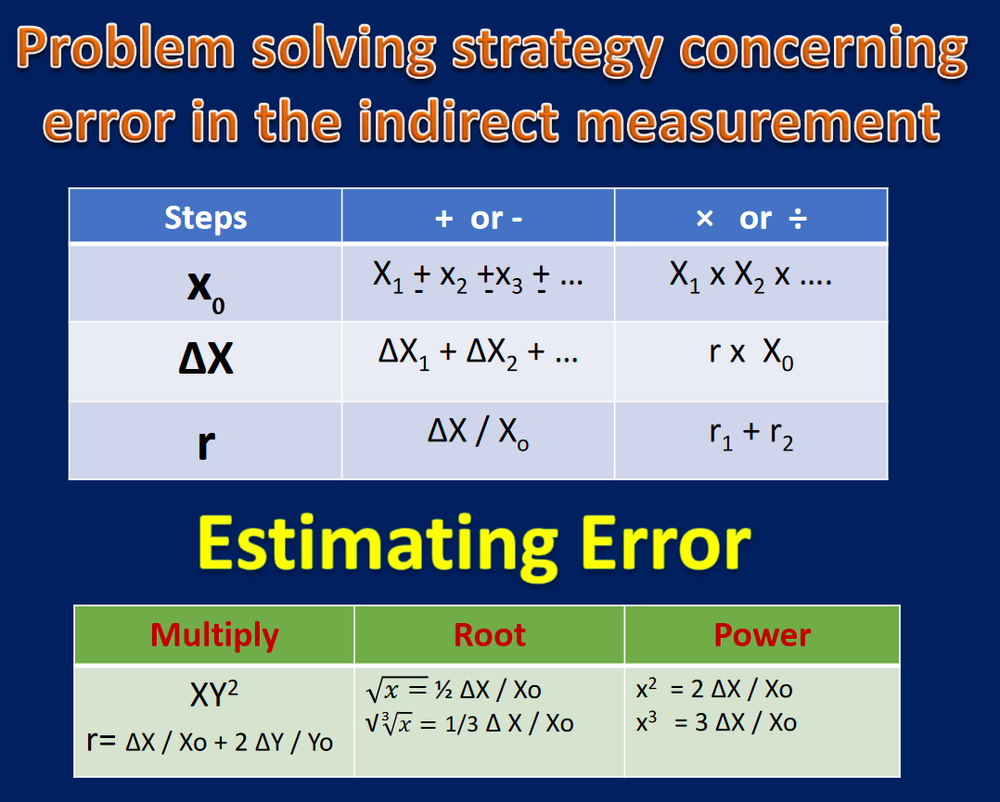

[GOOD REFERENCES]: https://www.khanacademy.org/science/physics/forces-newtons-laws/newtons-laws-of-motion/a/what-is-newtons-third-law
https://physics.stackexchange.com/questions/45653/given-newtons-third-law-why-are-things-capable-of-moving

>Standards for countries:

>Measurement prefixes
>

>Standard base of units

# Note that the second is measured off of the frequency of a Cesium isotope (which is defined as the time interval equal to 9192631770 periods of the radiation corresponding to the transition between the two hyperfine levels of the ground state of the Cesium-133 atom)

# Errors

Errors can be caused by: choosing the wrong device for measurement, an instrument error such as the aging and the battery, we can also get an environmental error where the length of an object can be deformed due to shrinkage or expansion due to the environment, we also have human errors which can be a parallax error (angle of reading) or a mathematical error.

We have systematic errors which can be fixed because they're a permanent deflection in one direction from the accurate measurement (although, precise).

We also have random errors which are neither accurate nor precise because they're just completely inaccurate and unknown, we don't know how they scatter or spread.

If we have real and the measured value, we can calculate the absolute error and relative error for the real measurement.

To get the absolute error for a direct measurement: $\Delta X=|x_0-x|$
To get the relative error for a direct measurement, we should calculate the absolute error first then plug it in the following: $r=\dfrac{\Delta x}{x_0}$ (we could multiply by 100 to get a percentage).

# The relative error is more precise than the absolute error.

Although, relative error measurements are more precise, we write the absolute error in the uncertainty measure next to the real value.

For calculating indirect measurements, if we're adding or subtracting numbers we should add the absolute error values and plug their sum into the relative error formula.
If we're multiplying and dividing, we should sum the relative error for all the indirect measurements. On top of all, x0 is the sum of all the real values incase of addition and subtraction, and the multiple in multiplication and division.

# LO2

The force is the action exerted on an object which may change the object's state of motion, as long as it's not in a static equilibrium, forces can also stop objects or change their directions depending on the way the force is exerted. Force is also responsible for the change of velocity over time (acceleration), force is measured by Newton and it's generally equal to $m*a$ where m is mass in kilograms, a is acceleration in $m/s^2$ therefore one Newton is: $1kg * 1m/s^2$ The weight of an object is also considered the magnitude of the gravitational force since it is the magnitude of the gravitational force exerted on the object. 

There are two types of forces which are contact and non-contact (Field) forces, contact forces are such as the friction force, spring force, tension force, while non-contact forces are such as electrostatic attractions, gravitational force, weak and strong nuclear forces (nuclear forces are responsible for collision at the microscopic level between atoms).

To describe a force, you must have the magnitude and direction of it, therefore, forces are a vector quantity. The force's direction in a diagram represents the real direction and the length of the vector on the diagram is proportional or equal to the magnitude of the force, the beginning is the center of mass of the object, in the diagram, only ***include forces that act on the drawn object***

There's a normal force which is the support force exerted to stop objects from passing through eachother, it's direction is perpendicular to the surface.

A system of forces, is a collection of forces acting upon one object at the same time, whether it be in an equilibrium or in a non-equilibrium.

# Static Equilibrium

We can exclusively indicate a rigid (movable) object is in equilibrium when both its linear (Along a straight line) and angular (around a unit circle perhaps) acceleration are zero, relative to an inertial frame of reference, I'll also talk about objects that have an equilibrium despite being in motion (which indicates that linear and angular accelerations are ***constant***), According to Newton's second law of motion which states that: $\Sigma F=ma$ we can substitute the acceleration here which results into the first law of Newton which states that $\Sigma F = 0$ which is the sum of all external forces acting on the body (in both laws).

All of the previous (summation operations) indicate the net force of an object, which is zero in the case of a static equilibrium which is literally the reason an object is **static**, same thing with net [**torque**](https://www.khanacademy.org/science/physics/torque-angular-momentum/torque-tutorial/a/torque)  (if you pop out the link, you can read about torque, it's not in the learning outcome but if you wanna give it a read, go on.). 

For example, if an object of 5KG mass is in a static equilibrium, determine the value of the normal force.
First off, we'll obviously state that $\Sigma F=0$, so, lets say the normal force is N so, N + (-mg) = 0, N - mg = 0, N = $5*9.8$ = 49 Newtons. (Or could be considered -49 Newtons according to which way you consider positive (in which case mg will be positive)).

Newton's first law is often referred to as the law of inertia as well, because it states that in the absence of a net force, a body will reserve it's state of motion (Either resting or moving) (object wants it's acceleration to be zero, otherwise, inertia force tries to resist the change.).

# Calculating net force for a non equilibrium.

To calculate the net force, see the given in the problem and choose a coordinate system which has the most number of forces along the x and y axes (or z in more complicated cases.)
Now, a vector has two components, an x and y component, think of it as an ordered pair, beginning from the origin point and to the vectors' end point.

Now let's talk about vectors for a little to avoid confusion, consider a vector arrow a hypotenuse of a right angled triangle that has a base and height, at the end of the vector hypotenuse, the height touches, which is the y coordinate of the vector, as known in math, the y coordinate is equal to the sine of the angle along the x axis in the right angled triangle times the hypotenuse's value, this is discarded in the unit circle.
Same goes for the x coordinate, except that it's equal to the cosine of the angle along the x axis in the right angled triangle of the vector, times the hypotenuse's value, yet again, and the proof for that is: 

Imagine a right angled triangle with a hypotenuse whose length is 22 cms (as a vector), we can conclude that $(cos \theta = \dfrac{Adj}{Hypo}) = (Adj = Hypo\cdot cos\theta)$ as long as this angle is on the x axis, we can conclude all of that (cosine is the same thing as sine, just change Adj (adjacent) to Opp (opposite)) where the Adj is the x coordinate of the vector and the Opp is the y coordinate of the vector.

The reason I said all of that? We need to decompose vectors into their x and y coordinates to be able to get the net force, once done, we put them along their axes and subtract all of the forces on the opposite quadrants (if you consider the right quadrant positive and the left quadrant negative along the x axis or consider the ASTC rule of the quadrants in the cos and sin calculations.)

$\Sigma F_x=$ Sum of all forces along the x axis.
$\Sigma F_y =$ Sum of all forces along the y axis.
Doing so results in the net force along the x and y axis, you can get the angle and direction of the vector through calculations of the x and y axis by composing them into a vector (using x as base and y as height.)

(I'm really proud of what I wrote above I don't know why but it gives me so much dopamine)

If there's a net force in an object, a second force equal in magnitude and opposite in direction will put the body in an equilibrium (Newton's third law.).

# Newton's second and third laws.

> [!important] 

Newton's second law states that when there is a net force, this implies that an object is being accelerated and there is no equilibrium, on a perfect non smooth surface as it would infinitely accelerate as there is no friction force, although if there was a friction force, it would accelerate at the beginning then not continue accelerating as the friction force would have the same magnitude therefore going back to being in an equilibrium.

It also states that the mass affects the net force and acceleration where a lightweight car accelerates more than a heavy truck if the same force is applied to both, so it requires less force to accelerate a low-mass object than it does to accelerate a high-mass object at the same rate.

The second law states:
$\Sigma F = ma$ where m is the mass of the affected object and a is the acceleration.
Where the summation is the net force.

It also states that the mass is inversely proportional to the acceleration (and force), while the acceleration is directly proportional to the force.

If more than one force is acting on an object, you must calculate the net force before getting the acceleration and applying Newton's second law.

You should use the law twice for all of the forces acting in the x direction ($\Sigma F_x=ma_x$) and in the y direction ($\Sigma F_y=ma_y$) if there is a system of equations, you should also decompose the acceleration into its two components (acceleration is a vector quantity).
In which case the summation is 0 that means the object is static or moving at a constant velocity.

The third law states: 
Each force exerted on an object when it interacts with another object in its environment has a force returned to it with equal magnitude and opposite directions. Which lead Newton to draw the conclusion that forces are never isolated and always exist in pairs.

The force that object 1 exerts on object 2 is called the *action force* (denoted by: $F_{12}$), whilst the opposite force (often called a reaction force) is denoted by: $F_{21}$ because it's the force exerted by object two on object 1 as a result, somewhat like a car when it rolls down a hill, it has a constant velocity and is in a dynamic equilibrium as long as it's not accelerating and the friction force reacts with the same magnitude in the opposite direction.

These action reaction forces happen simultaneously and must be on the same normal line (must not be on different axes or for the vector to have rotation, relative to it's action force).

The reason objects don't remain in a static position is because the motion of an object is affected only by the forces acting on the object itself, not the reaction forces, and usually there is a net force that acts on the object which allows for motion (one force is greater than the other). So, action-reaction pairs don't imply that the net force on both the objects in the system is equal to zero.

