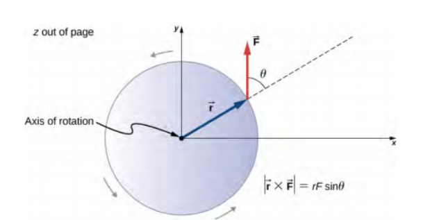

# Center of mass

It's the point at which the weighted relative position of the distributed mass sums to zero (the point at which objects rotate). Mathematically, it's defined as the cross-product of the vector by which the force's application point is offset relative to the fixed suspension point (distance vector) and the force vector, which tends to produce rotational motion.

In general, it's the point where the masses balance and can be hung without sliding to different directions, its rule depends on the amount of objects present where the rule is: $\dfrac{\Sigma M_iX_i}{\Sigma M_i}$ where Mi is the mass of an object in Kg and X is the length or the distance of the object from something (Say, the origin point).

The stability of an object is determined by the net forces affecting it, net torques and the center of the mass' displacement.

The center of gravity of an object is different from the center of mass, where it's the weight of the objects. The center of mass tends to be closer to larger objects. When the center of gravity doesn't coincide with the point of stability, the object falls over and when the center of gravity is nearest to the platform being walked on (or down), this provides more stability for the object itself.

The center of gravity relatively derives from the same law as the center of mass, where: $\dfrac{\Sigma M_igX_i}{\Sigma M_ig}$ where g is the gravity acceleration, Mi is the mass of the object and Xi is the distance from a certain point.

# Torque

The torque is a measure of the force that can cause an object to rotate about an ***axis***. Just as force is what causes an object to accelerate, torque is what allows an object to gain angular acceleration.
It's a vector quantity whose direction depends on the direction of the force on the axis. Torque is technically the rotational twin of force. Torque can be either static or dynamic.
It's always performed around the center of an object, despite being on a fulcrum, for example, a lever it has torque at its midpoint.

A static torque is one which does not produce any angular acceleration (in which case an object is not rotating or rotating at a constant angular speed). For example, a door's hinges have a static torque on them when being pushed by a normal force, not using the handle (assuming it's locked).

Someone pedaling a bike at constant speed is also in static torque as they're not causing acceleration.

The acceleration of torque is directly incorporated and proportional to the distance of the force affecting the body from the axis of rotation, same thing with the direction, if you push parallel to the axis of rotation, you're not going to cause any type of rotation, and finally, the larger the force affecting the body the faster it opens up.

The torque can also be called moment or moment of force and the radius at which the force acts is sometimes called the moment arm.

The magnitude of torque produced by a certain force with a moment arm at a certain angle equals $\tau = F\cdot rsin(\theta)$  Where theta is the angle between the force vector and the moment arm, r is the distance between the axis of rotation and the applied force point, by multiplying by r by sine theta we get the length of the moment arm. $\tau$ is the symbol indicating torque and F is the force vector.

The torque's measuring unit is Newton-meter or Nm ***NOT JOULES.***

The direction determined from the right-hand rule of vectors is anti-clockwise.

It can also be related to newton's second law by substituting F by ma therefore making $\tau=I\alpha$ where $\alpha$ is the angular acceleration and I is the rotational inertia (moment of inertia) generated by $mr^2$ where $\alpha$ is inversely proportional to the moment of inertia. This is called the rotational analog of Newton's second law.
# Simple machines

A simple machine is designed to change a form of energy into another different form of energy, also transfer forces along different axes or even cause greater forces to generate, to reduce the required force to lift something and modify the speed of something for example.

The six simple machines are levers, inclined planes (Although, not a machine, has a significance), pulley, wheel and axle and a wedge (Axe's wedge).

Let's talk a little about levers, you have different classes of levers, for example, the first class of levers which is referred to as the seesaw usually, has torques at each distance equal to eachother if it's only being affected by one side, therefore: $\tau_1 = \tau_2$ OR $F_1r_1=F_2r_2$., this rule is generally derived as the lever's law which states that: $F_1d_1=F_2d_2$ where F1 is the force on a side of the seesaw and d is the distance of the force's acting point to the fulcrum, same thing with the other d except F is on the other side of the seesaw.

The ideal mechanical advantage resulting from the machine is determined by the following rule: $\dfrac{F_{out}}{F_{in}} = \dfrac{d_{in}}{d_{out}}$, for a first class lever, this must be more than 1 or less than 1, for a third class lever, this must be less than 1 in which case it depends on the force acting on the lever.

In an ideal state, the larger force is directly associated to the smaller distance from the center of rotation and the smaller force is directly associated to the larger distance from said center of rotation.

A second class lever has a mechanical advantage greater than 1, a third class lever has a mechanical advantage less than one.

The efficiency of a machine should be calculated by: $\dfrac{W_{out}}{W_{in}}$  where W is the work done or exerted.

The mechanical advantage in an inclined plane is determined by the length of the plane divided by the height.

The mechanical advantage of pulleys equals to the number of ropes in the pulleys, in an Atwood's machine, an object is hung by a rope, to calculate the distance and the movement that the object performs you can use the following relation: $\dfrac{InputArm}{OutputArm}=\dfrac{OutputForce}{InputForce}$, in other words: Input arm * input force = output force * output arm. In an even better way: Force exerted on the rope * Distance pulled = Weight of object being pulled * Height raised.