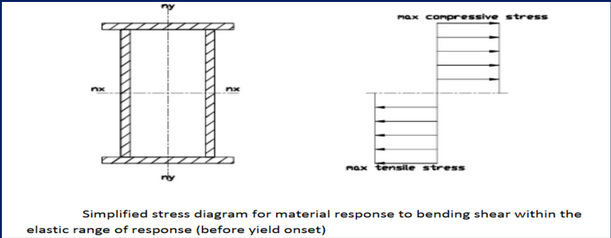
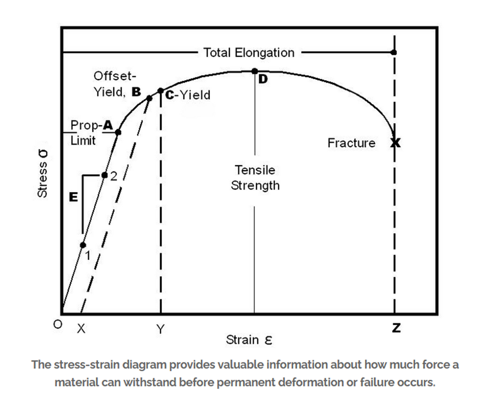

To finish off with the last two los, I grouped them up since they're extremely similar to eachother, I didn't want to write this file since yall probably studied this for your capstone regardless, but here I am for anyone interested, if you feel I hallucinated in the middle of this it's because i'm sick.

# Stress

The stress is the internal resistance of an object to resist deformation and transformation, this is always the force per unit area whether that area is in meters, kilometers, etc.. This is called the stress, also otherwise known as pressure (you can think of stress as an area, like how the atmospheric pressure is around 1 bar in a 1m by 1m area.). Stress can be measured by Newton per square meter, same unit as Pascal. Stress is also usually denoted by the lowercase sigma greek letter $\sigma$.

Types of stress or forces differ from one another, you have axial forces (along the x and y axes) and non axial stresses which are usually things affected in two directions with a torque or no torque.

## Axials:

1. Compressive which is inwards of the object making it deform and compress more.
2. Tensile which is the outwards stretch of the object making it elongate and break at a certain point.
## Non-Axials:

1. Shear which is the force that describes two forces affecting an object in two opposite directions along two different faces of the object making it look more like a parallelogram. It's force is the sum of forces acting on a cross section along the span of something.
2. Torsion which is the force generated by the torque squeezing of an object (like how you would with a wet towel). In short, torque forces in opposite directions.
3. Bending which is the force generated by the torque bending of an object where both rotations are in the same direction therefore making the objects' ends close on the direction.

# Strain

It's the compression or elongation of an object as a reaction to the force applied to it in hopes that it stays without fracturing or breaking. Strain is calculated as the difference in length over the original length, this is technically a percentage measurement of how much it has deformed over the original length. Strain = $\dfrac{\Delta L}{L_0}$ Strain has no measuring unit since you're dividing the lengths of the same units. It's usually defined as the greek letter Epsilon $\epsilon$.

# Hooke's law

Obviously, by the looks of it, you can deduce that there's a proportional between stress and strain, but in reality, this proportional has a ***limit***, this limit is called the proportional limit and it's hit at a certain point, after this proportional limit is a point called a yield point which is the point that the object turns into a plastic state (has the same deformation even after removing the force applied on the object) much like how rubber can shrink permanently. Before the yield point is the elastic side which is when the object tends to go back to its original shape.

This is well described by the following graph:

You can see that between the points A and O, the object remains in a state where stress is directly proportional to strain, then it hits the proportional limit where ***Hooke's law breaks.*** After that is the offset-yield, which isn't important but it's used for objects that have an unknown yield point.

At point C the object completely turns plastic and deforms permanently. At point D is the point with the highest stress, if the curve continues going up above this point, it fractures.

At point Z (x), the object fractures a little below the proportional limit, this is due to the tendency of the object to want to go back to its original state but the incapability of doing so.

The direct formation of Hooke's law as a mathematical relation, as previously stated must be in the span of the proportional limit and the point where forces start getting applied. The formula itself is $F=-kx$ where k is the spring constant (N/m) for this elastic material (counterintuitively to the name, it's not limited to springs), it measures the stiffness of an object to expansion and contraction and x is the elongation of the object or the strain and F is the restoring force of the object. The negativity is added to signify that the force is in the opposite direction of the force that was applied on the springy object.
# Young's modulus

Young's modulus is a measure of elasticity of an object (reason it's called the elastic modulus aswell), It's a mechanical property of solid materials that measures the tensile and compressive stiffness (rigidity) of an object. This is a constant across different types of materials, this gives us a direct relation between stress and strain in the linear elastic region of the material (before proportional limit and yield point.).

It's defined as: $E=\dfrac{\sigma}{\epsilon}$ Its measuring unit is Pascal or Gigapascal. By lowering young's modulus, an object elongates quickly as there's an inverse proportional between the modulus and strain, by increasing the modulus, the length deformation decreases.

# Shear modulus

This modulus defines a proportional between shear stress and shear strain, much like young's modulus it has about the same explanation, just used differently. Usually denoted as G.

# Bulk modulus

It's defined as the resistance of an object to compression, somewhat different from Young's modulus, it provides a relation between the difference of volumes of the object and the stress applied to it. It also explains the decrease of the volume relative to pressure, hence the positive result (we have a negative before the fraction because the difference of volume is negative). The modulus equals $K=-\dfrac{\Delta P}{\dfrac{\Delta V}{V_0}}$ where delta P is the difference in pressures/stresses applied, delta V is the change in volumes and V nought is the original volume.

# Elastic potential energy

Springs, elastic objects and such store potential energy that can be transformed into kinetic energy, the energy is gotten through the relation and is calculated as $E=\dfrac{1}{2}kx^2$.

Keep in mind of the mechanical advantage as some questions I stumbled upon have used this.